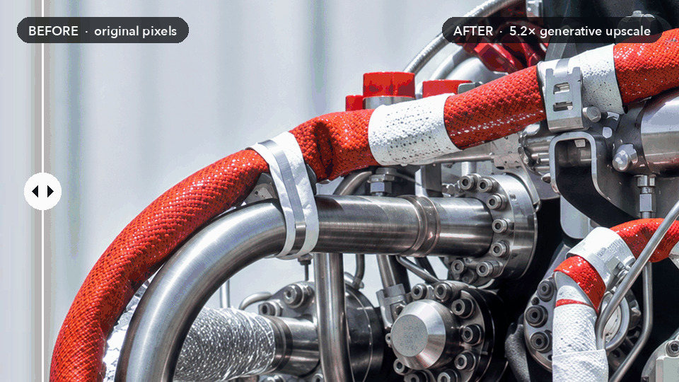
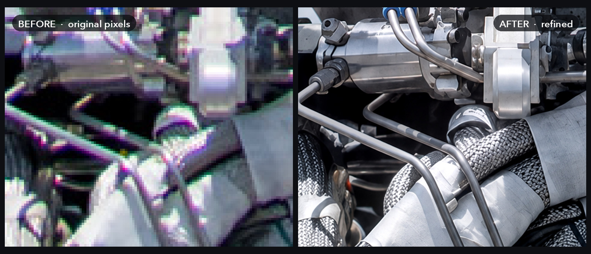
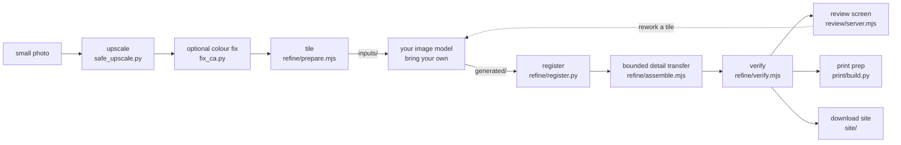

<h1 align="center">massive-generative-upscaler</h1>

<p align="center">
  <strong>From one 4K photo to a 1.7-metre print, with real-looking detail all the way in.</strong>
</p>

<p align="center">
  <a href="LICENSE"></a>
  <a href="https://github.com/Loringtonian/massive-generative-upscaler/actions/workflows/test.yml"></a>
  
  
</p>

<p align="center">
  
</p>

<p align="center"><sub>A real crop from a real run: 256 × 144 original pixels on the left, the same spot in the finished 20,043 × 12,600 print file on the right.<br>Original photo: SpaceX. This project is not affiliated with SpaceX.</sub></p>

|                       | Original      | Finished print file     |
| --------------------- | ------------- | ----------------------- |
| Width × height        | 3,840 × 2,414 | **20,043 × 12,600**     |
| Pixels                | 9.3 MP        | **252.5 MP** (27× more) |
| Print size at 300 ppi | 32 × 20 cm    | **170 × 107 cm**        |

An upscaler on its own mostly makes a bigger, softer image. This toolkit adds a second, **generative** pass: an
image model redraws the picture crop by crop, every redraw is locked back onto the
photo with feature matching, and only the fine detail is kept. Lighting, colour and
composition stay the photograph's own.

The toolkit does five things:

- **Upscale**: a tiled, resumable neural upscaler with a memory cap.
- **Refine**: an image model redraws overlapping crops. Each redraw is registered back
  onto its source, and only bounded fine detail is kept.
- **Review**: a deep-zoom before/after slider with defect pins and a version history.
- **Print**: extends the canvas from real pixels, adds bleed, sets the ppi and writes
  lossless TIFFs.
- **Publish** (optional): a static zoom site whose downloads come from a private
  Cloudflare R2 bucket through signed links that expire.

> **The added detail is AI-generated.** A small photo does not hold the missing
> information, and no tool can get it back. The upscaler guesses at structure. The image
> model draws texture and small features that look right but are not real. Registration
> and bounded transfer keep the result faithful to the photo's layout, lighting and
> colour. They do not make invented detail authentic. Describe results as _AI-refined_,
> not _restored_ or _recovered_.

## Up close

<p align="center">
  
</p>

<p align="center"><sub>The same 120 × 100 original pixels, before and after. Braided hose, clamps and tape come out of the blur. The weave is drawn by the image model: it looks right, but it is not recovered data.</sub></p>

## Pipeline



```
photo ─► upscale ─► (colour fix) ─► tile ─► YOUR MODEL ─► register ─► detail transfer ─► verify
                                     ▲                                                    │
                                     └──────────── review screen (pins, rebuilds) ◄───────┤
                                                                   print prep ◄───────────┤
                                                                 download site ◄──────────┘
```

## Quick start

```bash
git clone https://github.com/Loringtonian/massive-generative-upscaler && cd massive-generative-upscaler
pip install -r requirements-dev.txt   # numpy, pillow, opencv, pytest, ruff
npm ci                                # sharp, openseadragon, prettier
make test                             # lint + Python + JS tests
make demo                             # full dry run on a synthetic image with a fake "model"
```

`make demo` draws a synthetic picture and tiles it. A stand-in model sharpens each crop
and shifts, rotates and resizes it slightly. The demo then registers, assembles and
verifies, and writes everything to `work/demo/`, which git ignores.

A real run:

```bash
# 1. Upscale (needs torch + spandrel and a model file; see "Which upscale model")
python3 upscale/safe_upscale.py work/your-image.jpg work/upscaled.png models/your-model.pth 128
python3 upscale/fix_ca.py work/upscaled.png work/upscaled_defringed.png        # optional

# 2. Tile
cp refine/config.example.json work/refine.json   # edit input, target size, tile size, protected areas
node refine/prepare.mjs work/refine.json

# 3. Redraw every work/refine/inputs/<id>.png with your image model,
#    saving each result as work/refine/generated/<id>.png (see "The redraw step")

# 4. Register, transfer, verify
python3 refine/register.py work/refine.json
node refine/assemble.mjs work/refine.json
node refine/verify.mjs work/refine.json
```

## Tools

### Upscale (`upscale/`)

| Tool                | What it does                                                                                                                                                                                                                                                                                             |
| ------------------- | -------------------------------------------------------------------------------------------------------------------------------------------------------------------------------------------------------------------------------------------------------------------------------------------------------- |
| `safe_upscale.py`   | Tiled upscaler for any [spandrel](https://github.com/chaiNNer-org/spandrel) model. Caps MPS memory so it errors instead of swapping. Writes to an on-disk memmap, so a kill loses one tile at most. Re-running the same command resumes. `safe_upscale.py <in> <out> <weights> [tile=128] [max_tiles=0]` |
| `memguard.py`       | Watchdog for a running job. Kills it (exit 2) if available memory drops below a floor or its RSS passes a cap. `memguard.py <pid> [floor_gb=1.6] [rss_cap_gb=3.5] [log]`                                                                                                                                 |
| `fix_ca.py`         | Chromatic-aberration fix: searches radial scales for red and blue against green, then damps chroma at strong edges (up to 55%). `fix_ca.py <in> <out>`                                                                                                                                                   |
| `ensemble_patch.py` | Runs the model 8 ways on one region (4 rotations × flip) and averages, to calm artefacts. `ensemble_patch.py <in> <weights> x y w h ctx <out_prefix>`                                                                                                                                                    |
| `upscale.py`        | Standalone 4× RRDBNet (Real-ESRGAN x4plus layout), no spandrel. Keeps the whole output in RAM.                                                                                                                                                                                                           |
| `convert_esrgan.py` | Renames old ESRGAN checkpoint keys (`model.N.sub…`) to RRDBNet names.                                                                                                                                                                                                                                    |
| `notify_done.sh`    | Waits for an output file and sends a desktop notification when it appears or when the job stops early. Gives up after about 2.5 h.                                                                                                                                                                       |

#### Which upscale model

Model weights are not included. These are the ones behind the example at the top:

| Model                                                            | Licence      | How it did                                                                                                                                                                                                                 |
| ---------------------------------------------------------------- | ------------ | -------------------------------------------------------------------------------------------------------------------------------------------------------------------------------------------------------------------------- |
| **[Real-ESRGAN x4plus](https://github.com/xinntao/Real-ESRGAN)** | BSD-3-Clause | **Used for the final base.** 4× enlargement, then `fix_ca.py`, then the generative refine pass. Weights: [`RealESRGAN_x4plus.pth`](https://github.com/xinntao/Real-ESRGAN/releases/download/v0.1.0/RealESRGAN_x4plus.pth). |
| [DAT-2](https://github.com/zhengchen1999/DAT) (x4)               | Apache-2.0   | Tried first; its 4× output became the comparison base. On a second enlargement it added a mesh pattern. Weights are linked from the project's README ("pretrained models").                                                |
| Plain Lanczos resize                                             | n/a          | Best for any enlargement **after** the first 4×. A second AI pass invented crack textures (Real-ESRGAN) or a mesh (DAT). `refine/prepare.mjs` does this resize for you when `target` is set.                               |

```bash
mkdir -p models
curl -L -o models/RealESRGAN_x4plus.pth \
  https://github.com/xinntao/Real-ESRGAN/releases/download/v0.1.0/RealESRGAN_x4plus.pth
python3 upscale/safe_upscale.py work/your-image.jpg work/upscaled.png models/RealESRGAN_x4plus.pth 128
```

Any other 4× model that [spandrel](https://github.com/chaiNNer-org/spandrel) can load also
works; [OpenModelDB](https://openmodeldb.info) lists many. Try a few on one crop with
`ensemble_patch.py` before you commit to a full run, and check each model's licence.

### Refine (`refine/`)

The core idea: an image model draws a much better small crop than a whole picture, so
redraw the image **crop by crop**. Then bring back **only** the fine detail, and only
where the base already has edges.

1. **`prepare.mjs`** resizes the upscaled image to `target` (Lanczos3). It writes
   `base.tif` and cuts overlapping crops (`tile.size`, `tile.overlap`) over the whole
   image or only over `regions`. The last row and column snap to the edge. It writes
   `inputs/<id>.png` and `manifest.json`.
2. **The redraw step**: you send each input crop to your model and save the result as
   `generated/<id>.png`. It may come back at a different size.
3. **`register.py`** runs SIFT with a ratio test, then RANSAC fits a similarity transform
   (shift, rotation, uniform scale) from each generated crop onto its source crop. It
   warps the crop into the source frame (`aligned/<id>.png`) and writes the numbers to
   `registration.json`. A tile passes only if it has enough inliers, a small median
   residual, a scale close to _source size / generated size_, and a small shift. Any
   failure makes the script exit 1.
4. **`assemble.mjs`** works on each registered tile:
   `delta = clamp((gen − blur(gen)) − (base − blur(base)))`, averaged over RGB so that
   only luminance moves. It is weighted by an edge gate, `strength`, a feather at the
   tile border and a fade near protected rectangles. Tiles are blended through feathered
   alpha, so overlaps mix instead of overwrite. Protected rectangles are then copied back
   from the base pixel for pixel (`preserve.mjs`). Outputs: `exports/refined.tif` (LZW,
   sRGB, ppi set), a quality-100 4:4:4 JPEG, a preview and `qa/assembly-audit.json`. If
   the export already exists, the script stops unless you pass `--force`.
5. **`verify.mjs`** checks size and ppi, confirms every protected rectangle is identical
   to the base, records sha256 hashes, and writes side-by-side sample crops to `qa/`.

If a generated crop is missing, that tile stays unchanged. To skip a tile for good, put
its id in `skip`.

#### The redraw step: bring your own image model

There is no model call in this repository. Use any image model you like: a local
diffusion model, a hosted API, or an assistant's built-in image tool.

```
work/refine/inputs/r02_c03.png  ──►  your model + refine/prompt-template.txt  ──►  work/refine/generated/r02_c03.png
```

[`refine/prompt-template.txt`](refine/prompt-template.txt) is a general-purpose
fidelity prompt. It keeps the framing, geometry, counts, occlusions and lighting,
improves only texture and small regular features, and forbids invented text. It also
has a variant for fixing one named area. Attaching the untouched original photo of the
same area as a layout reference helps. Expect the model to drift a few pixels and a
fraction of a degree. That drift is what registration corrects. Crops that drift too
far are rejected rather than blended.

#### Config reference (`refine/config.example.json`)

| Key                                   | Default                   | Meaning                                                                                      |
| ------------------------------------- | ------------------------- | -------------------------------------------------------------------------------------------- |
| `input`                               | required                  | Upscaled image (path relative to the config file)                                            |
| `workDir`                             | `work/refine`             | Where every intermediate and export goes                                                     |
| `target.width`, `target.height`       | input size                | Final pixel size (e.g. `sheet inches × 300`)                                                 |
| `density`                             | `300`                     | ppi written to the exports                                                                   |
| `tile.size`, `tile.overlap`           | `1024`, `256`             | Crop size and overlap in target pixels                                                       |
| `regions`                             | whole image               | `[[x, y, w, h], …]` areas to tile; leave smooth backgrounds out                              |
| `skip`                                | `[]`                      | Tile ids to leave out                                                                        |
| `protected`                           | `[]`                      | `[[x, y, w, h], …]` kept pixel-identical to the base (text, faces, earlier manual repairs)   |
| `registration.minInliers`             | `50`                      | Minimum RANSAC inliers                                                                       |
| `registration.maxMedianErrorPx`       | `1.5`                     | Maximum median residual of inliers                                                           |
| `registration.maxScaleDeviation`      | `0.025`                   | Allowed deviation from the expected scale                                                    |
| `registration.maxTranslationPx`       | `25`                      | Maximum shift                                                                                |
| `registration.ratio`                  | `0.7`                     | Lowe ratio test                                                                              |
| `registration.ransacThreshold`        | `3`                       | RANSAC reprojection threshold (px)                                                           |
| `transfer.blur`                       | `3`                       | Gaussian sigma that splits fine detail from broad shading                                    |
| `transfer.edgeThreshold`, `edgeRange` | `3`, `15`                 | Edge gate: no transfer below the threshold, full transfer at threshold + range               |
| `transfer.strength`                   | `0.45`                    | Share of the detail difference that is applied                                               |
| `transfer.maxDelta`                   | `18`                      | Clamp on the difference (code values) before strength is applied; max change = 18 × 0.45 ≈ 8 |
| `transfer.feather`                    | `100`                     | Tile-border feather (px)                                                                     |
| `transfer.protectFeather`             | `45`                      | Fade distance around protected rectangles (px)                                               |
| `output.name`, `jpeg`, `preview`      | `refined`, `true`, `2400` | Export name, write a JPEG too, preview width                                                 |

The defaults are conservative on purpose. Pasting whole generated crops in gives a
sharper look, but it can add texture that does not belong and rewrite text.

### Review screen (`review/`)

```bash
cp review/review.config.example.json work/review.json   # list your versions
node review/server.mjs work/review.json                  # http://127.0.0.1:8779  (PORT=... to change)
```

- A deep-zoom before/after slider. Both sides share one camera, and full-resolution
  TIFFs are served as tile pyramids.
- **Left / right pickers** for any version, a region picker (full image or any tile),
  and swap.
- **Frames.** Give a version a `frame: {x, y, width}` in reference-image widths when
  its crop or aspect differs, for example an extended print canvas. `x`, `y` say where
  its pixel (0, 0) falls in the reference, and `width` is its width against the
  reference. Differently cropped versions then line up across the slider. Versions
  without a frame fill the reference exactly.
- **Defect pins.** Place a pin, write a note, pick a category and a requested action,
  then save. Pins can be dragged or nudged with the arrow keys. Every save keeps the
  previous notes file in `history/`. A revision check stops two tabs from overwriting
  each other, and Export notes downloads a copy.
- **Tile rebuild.** Takes one tile from an earlier version, matches its broad colour to
  the current master and feathers it in. The result is a new, separate candidate
  (`jobs/<id>/master.tif`, optional JPEG exports, a pyramid, and tile/seam comparisons).
  Pixels outside the tile are never changed. `node review/check-rebuild.mjs <config>
<job-id>` proves it. A rebuild does not run a new generative pass: send the tile
  through `refine/` for that.
- **Localhost only.** The server rejects foreign `Host`/`Origin` headers, serves images
  only from the registry, caps request sizes and saves atomically.

Review config keys: `port` (8779), `dataDir` (notes, comparisons, pyramids, jobs),
`refineWorkDir` (turns on tiles and the generated/aligned stages), `overview`
(minimap image), `reference` (`{width, height}`, taken from the refine manifest if
left out), `versions` (`[{id, label, path, frame?}]`), `defaults` (`{left, right}`
version ids), `current` (the version a rebuild starts from), `exports`
(`[{name, width}]` JPEGs per rebuild), `rebuild` (`feather`, `colorMatchSigma`,
`seamPad`) and `comparisons` (a seed file; see
[`review/examples/comparisons.json`](review/examples/comparisons.json)).
Comparison image paths are relative to `dataDir`.

### Print prep (`print/`)

```bash
cp print/print.example.json work/print.json
python3 print/build.py work/print.json
```

- **extend**: adds `left/right/top/bottom` pixels by copying the strip `period` pixels
  further in, so repeating patterns such as panels, tiles or brickwork carry on. Nothing
  is mirrored. The copy is lined up vertically along the seam (`search` px), evened out
  row by row for brightness, and blended over `blend` px. `period` must be at least the
  extension width.
- **label** (optional): draws `text` at `x`, `y` (fractions of the canvas) with
  `sizePx`, `color`, `anchor` and an optional TrueType `font`.
- **prints**: for each `sheetInches` it takes the largest centred trim of that shape that
  leaves room for `bleedInches` on every side (`offset` moves it). It cuts trim + bleed,
  and resamples with Lanczos to an exact `ppi` if you set one; otherwise the ppi is
  whatever the pixels give. `minPpi` adds a warning. Files are deflate TIFFs that keep
  the source ICC profile and carry ppi metadata. `build.json` records the numbers.

Ask your print shop what bleed and finishing allowance it needs before you cut. Print a
small section at 100% on the real material before ordering the full size.

### Download site (`site/`, optional)

A single-page viewer shows the refined image as a zoom pyramid. The original sits
underneath under the same camera, and a divider reveals it. The page has keyboard
support, pixel-smoothing and "get yours" checkboxes that survive a reload, and cues
for phones.

```bash
cp site/config.example.json site/config.json   # masterTiff, masterJpeg, original, title, note, ...
node site/build.mjs                            # writes site/dist/ (tiles rebuild only when the master changes)
node site/serve.mjs                            # http://127.0.0.1:8781
```

Deploying to Cloudflare Pages:

1. Put the JPEG and TIFF in a **private** R2 bucket under `files/`. Set `YOUR_BUCKET`
   and `YOUR_PAGES_PROJECT` in `site/wrangler.toml`.
2. Add the Pages secret `DL_SIGNING_KEY` (a long random string).
3. `CLOUDFLARE_API_TOKEN=... ./site/deploy.sh` (preview) or `./site/deploy.sh main`
   (production). The token comes from your environment. Never commit it.

`functions/api/download.js` hands out links signed with HMAC-SHA256 that work for 5
minutes. `functions/files/[[path]].js` streams from R2, supports range requests, and
turns away unsigned or expired links with a 403. Optional Cloudflare Turnstile: set
`"humanCheck": true` and `turnstileSiteKey` in the config, and set the Pages variable
`REQUIRE_HUMAN_CHECK=1` and the secret `TURNSTILE_SECRET`. A per-IP rate limit on
`/files/` and `/api/download` is best set as a Cloudflare WAF rule. `site/test_mobile.py`
is an optional Playwright check of the running preview on phone sizes.

## Tests

```bash
make test        # ruff + prettier check, pytest, node:test
```

- **pytest** (`tests/`): tiling covers every pixel; registration recovers a known
  shift, rotation and scale to within 0.5 px at the crop corners; aligned crops match
  their sources; output size and ppi are right; changes stay within `strength ×
maxDelta`; protected regions are pixel-identical; colour stays on the base; print
  math covers bleed, ppi, largest trim, extension and label; the chromatic-aberration
  scale search works; memguard exits cleanly and trips on its RSS cap; the site builds
  from the refined output.
- **node:test** (`tests/js/`): the tile grid and transfer weights; config validation;
  HMAC sign/verify including expiry and tampering; the download and files functions
  against a fake R2 bucket; the review server (serves its pages, rejects foreign hosts
  and origins, blocks path traversal, prepares comparisons, checks note revisions, and
  a tile rebuild changes only its tile).

The neural upscalers are not run in CI because they need model weights.
GitHub Actions runs `make test` on every push
([`.github/workflows/test.yml`](.github/workflows/test.yml)).

## Layout

```
upscale/   neural upscaling, memory guard, colour fix
refine/    prepare → (your model) → register → assemble → verify; prompt template; example config
review/    review server, history/rebuild API, public/ page, example registry and config
print/     canvas extension, label, bleed/ppi print cutter
site/      static zoom site + Cloudflare Pages functions for signed downloads
tools/     synthetic test image and a stand-in "model" for dry runs
tests/     pytest + node:test suites
```

## License

[MIT](LICENSE) © Loringtonian. OpenSeadragon, installed from npm, is under its own
BSD-3-Clause licence, which the site build copies next to the library.
